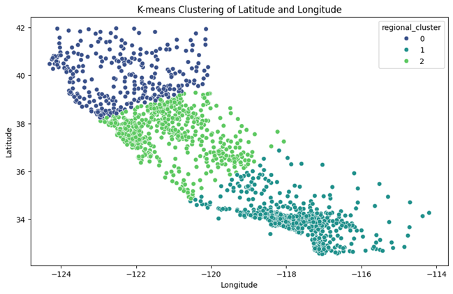
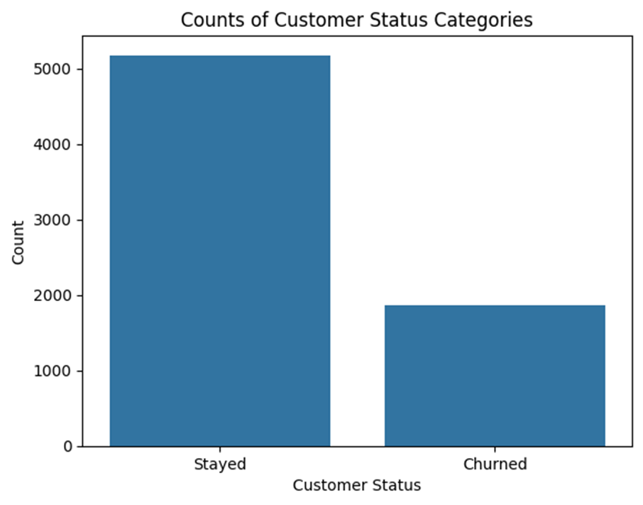
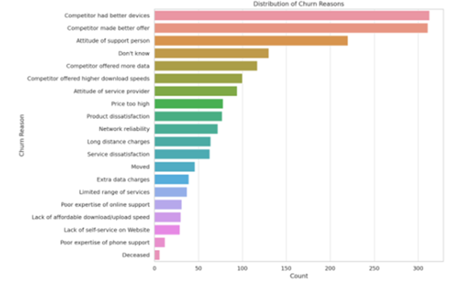
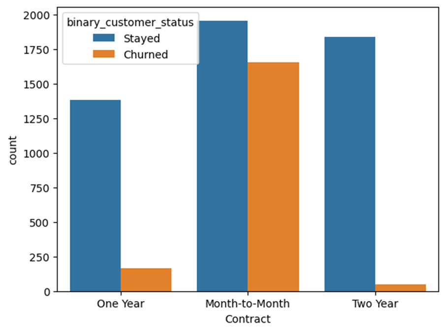
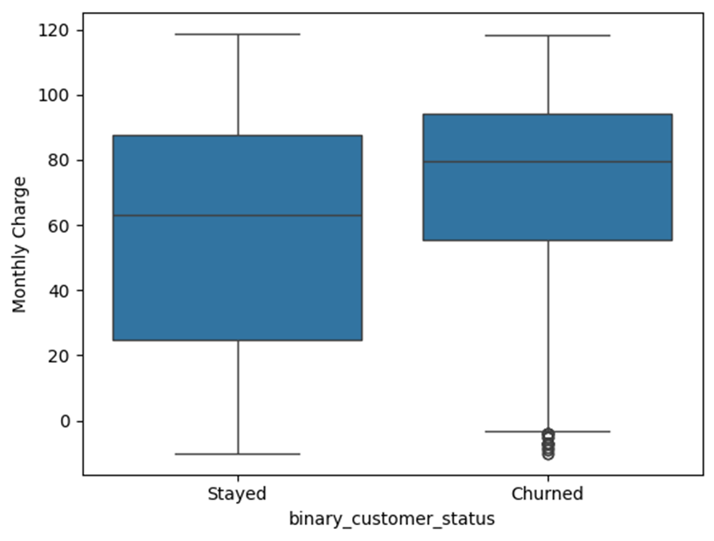
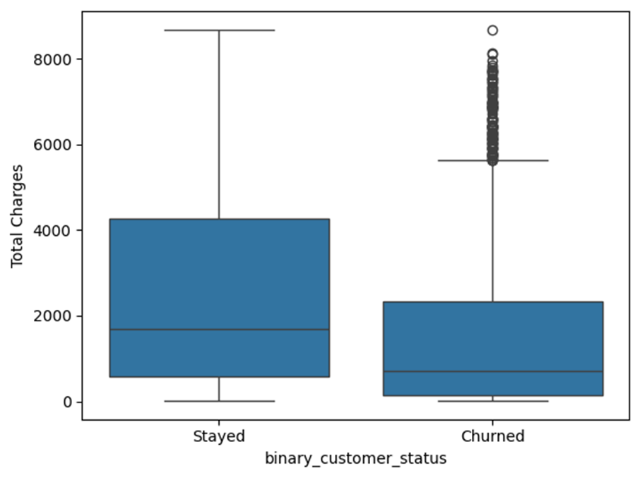
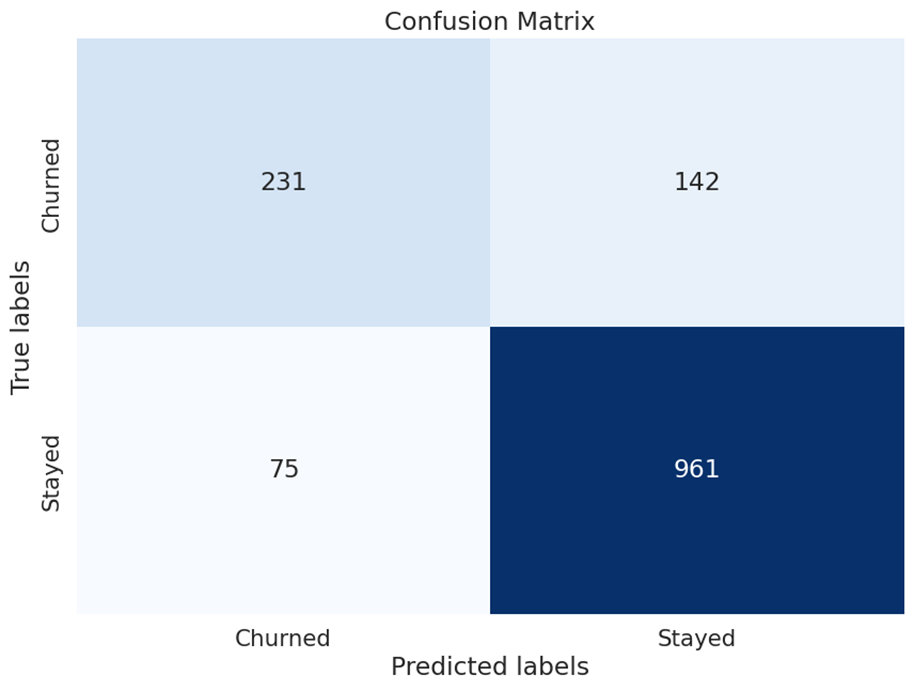
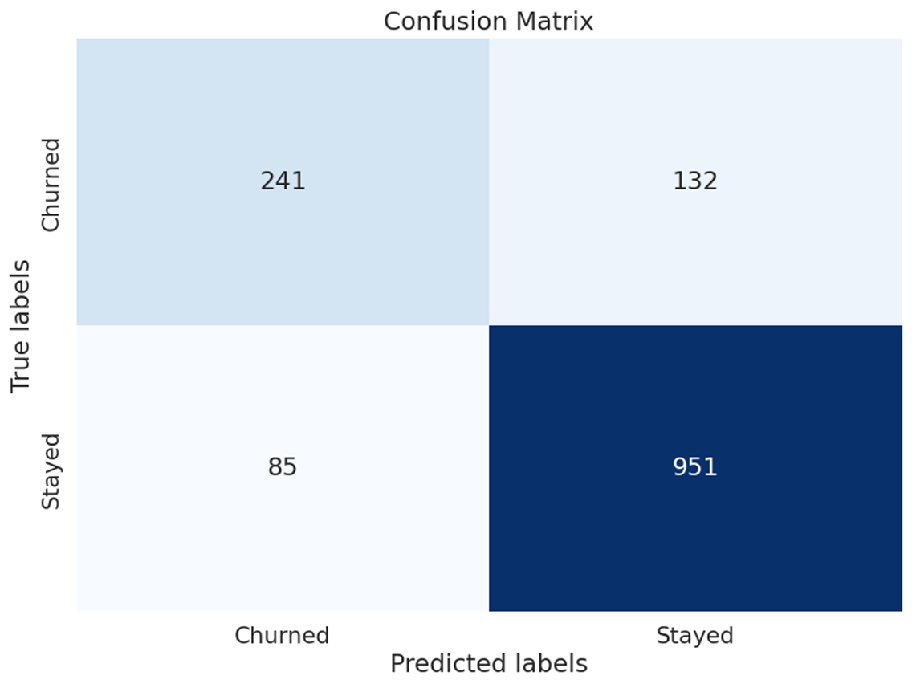

# Predictive Analysis of Customer Churn in the Telecom Sector

## Table of Contents
- [Introduction](#introduction)
- [Data](#data)
- [Data Cleaning](#data-cleaning)
- [Exploratory Data Analysis](#exploratory-data-analysis)
- [Modeling](#modeling)
- [Conclusion](#conclusion)
- [How to Use](#how-to-use)
- [Results](#results)
- [License](#license)

## Introduction
Customer churn, where customers switch from one service provider to another, poses a significant challenge for telecommunications companies. This project leverages data science methodologies to analyze customer data, understand the underlying factors of churn, and develop predictive models to forecast potential churn. This enables telecom companies to implement targeted retention strategies and enhance customer loyalty.

## Data
The dataset used in this project is sourced from [Kaggle](https://www.kaggle.com/datasets/shilongzhuang/telecom-customer-churn-by-maven-analytics/data). It contains 7043 rows and 38 columns, each representing a customer from a telecommunications company in California in Q2 2022. Key features include demographic information, service usage, and customer status (churn, stay, join).

## Data Cleaning
Data cleaning involved:
- Removing irrelevant columns like Customer ID.
- Converting zip codes to strings and handling leading zeros.
- Addressing missing values by assigning default values based on logical assumptions.

## Feature Engineering

**Location and Demographics:**  
Used K Means Clustering to derive location information from the customer latitude and longitude.


## Exploratory Data Analysis
Approximately 26.5% of customers churned in Q2.


Service experience and financial factors are key determinants of churn decisions, with demographics like age and gender having minimal impact. 


Long term contracts have a significantly lower churn rate than monthly contract.


Elevated monthly charges significantly contribute to higher churn rates, underscoring the need for competitive and flexible pricing strategies.


A correlation between total charges and lower churn rates indicates that customers with longer tenures are less likely to churn. 



Therefore, telecom companies should focus on improving service quality and customer engagement to build lasting relationships.

Prioritizing competitive pricing and fostering long-term engagement can effectively reduce churn rates and boost customer satisfaction and loyalty.

## Modeling
Our approach included a preprocessing pipeline with one-hot encoding of categorical features, data scaling, and handling the imbalance in the target variable through down-sampling and up-sampling. This ensured that we evaluated the models on both balanced and unbalanced datasets to identify the most effective prediction model.

Three machine learning models were used to predict customer churn, and they were measured by accuracy on the test data.
1. **Logistic Regression:** 83.7% (unbalanced)

2. **Random Forest Classifier:** 84.6% (unbalanced)

3. **Support Vector Machine (SVM):** 84.6% (unbalanced)



While both Random Forest and SVM demonstrated top performance, the choice of the best model depends on business needs. The unbalanced dataset yielded the highest accuracy, yet balanced datasets improved the prediction of churned customers. This trade-off suggests that businesses must decide between models based on their intervention strategies and the costs associated with incorrectly predicting churn.

## Conclusion
 The analysis revealed that service quality, pricing strategies, and customer engagement are key attributes in predicting churn, while demographic factors like age and gender are less significant. 
 
 Utilizing Logistic Regression, Random Forest Classification, and Support Vector Machine, the study achieved high accuracy in identifying potential churners. 
 
 These findings highlight the potential for telecom companies to adopt data-driven strategies that combine competitive pricing with exceptional service delivery and long-term customer engagement. 
 
 This study provides a practical guide for telecom providers to reduce churn rates and enhance customer loyalty through predictive analytics.

## How to Use
To replicate this project, follow these steps:
1. Clone the repository to Google Drive: `git clone https://github.com/sdeery14/telecom-customer-churn.git`
2. Open the files 'telecom-customer-churn-eda.ipynb' and 'telecom-customer-churn-modeling.ipynb' in Google Colab.
3. Update the urls for the data files to the cloned repository if needed.
```python
# data
customer_df = pd.read_csv('gdrive/My Drive/telecom-customer-churn/data/telecom_customer_churn.csv')
pop_df = pd.read_csv('gdrive/My Drive/telecom-customer-churn/data/telecom_zipcode_population.csv')
data_dict = pd.read_csv('gdrive/My Drive/telecom-customer-churn/data/telecom_data_dictionary.csv', encoding='latin1')
```
4. Run the notebooks to see the analysis and modeling in action.

## Results
The best-performing models were Random Forest and SVM, both achieving an accuracy of 84.6%. The choice of model may depend on whether the goal is to maximize overall accuracy or to correctly identify customers likely to churn.

## License
This project is licensed under the MIT License - see the [LICENSE](LICENSE) file for details.

